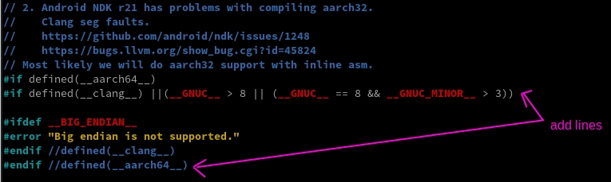
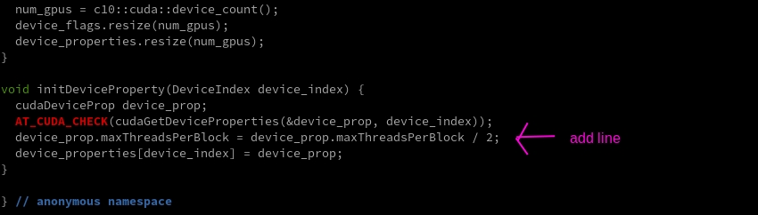
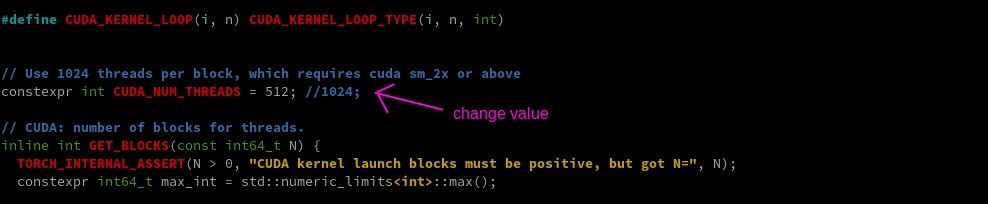
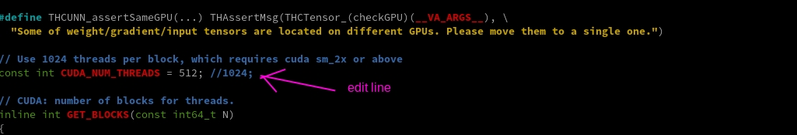

# PyTorch / Torchvision

## Installation from scratch

#### Update your system
```
$ sudo apt update
```

#### Dependencies
```
$ sudo apt install llvm lzma liblzma-dev zlib1g-dev libncurses5-dev libgdbm-dev libnss3-dev libssl-dev libreadline-dev libffi-dev libsqlite3-dev wget libbz2-dev -y
$ sudo apt install ninja-build git cmake -y
$ sudo apt install libjpeg-dev libopenmpi-dev libomp-dev ccache -y
$ sudo apt install libopenblas-dev libblas-dev libeigen3-dev nano -y
```
> Altinstall of python - If you have another version of python installed and its not set to exec using python3 but rather its full ver name like python3.9 then change it to that name instead of python3.
```
$ sudo -H python3 -m pip install wheel mock pillow
$ sudo -H python3 -m pip install testresources
```
above 58.3.0 you get version issues
```
$ sudo -H python3 -m pip install setuptools==58.3.0
$ sudo -H python3 -m pip install scikit-build
```
#### Make sure your in your home directory
```
$ cd $HOME
```

#### Download PyTorch
Pick a version (don't use both commands!! pick one)

>***1.9.0***
```
$ git clone -b v1.9.0 --depth=1 --recursive https://github.com/pytorch/pytorch.git
```
***1.10.0***
```
$ git clone -b v1.10.0 --depth=1 --recursive https://github.com/pytorch/pytorch.git
```

#### Install pytorch's requirements.txt
```
$ cd pytorch
```
one command to install several dependencies in one go
installs future, numpy, pyyaml, requests
setuptools, six, typing_extensions, dataclasses
```
$ sudo -H python3 -m pip install -r requirements.txt
```

#### Enlarge memory swap
Note: If you did not uninstall/remove this after installing openCV then you can skip this section
>Install dphys-swapfile
```
$ sudo apt-get install dphys-swapfile -y
```
Enlarge the boundary
```
$ sudo nano /sbin/dphys-swapfile
```
___edit/change: CONF_MAXSWAP=2048 to CONF_MAXSWAP=6000___
Give the required memory size
```
$ sudo nano /etc/dphys-swapfile
```
___edit/change: #CONF_SWAPSIZE= to CONF_SWAPSIZE=6000___
reboot afterwards
```
$ sudo reboot
```
after reboot check that you now have enough memory
```
$ free -m
```
Make sure your in  directory after swap
```
$ cd $HOME
$ cd pytorch
```

#### Install the clang compiler
```
$ sudo apt-get install clang
```

#### Modify the PyTorch code
Only run the commands/edits for the version you downloaded!
>***1.9.0***
```
$ nano ./aten/src/ATen/cpu/vec256/vec256_float_neon.h
```
***1.10.0***
```
$ nano ./aten/src/ATen/cpu/vec/vec256/vec256_float_neon.h
```

Around line 28 add ``#if defined(__clang__) ||(__GNUC__ > 8 || (__GNUC__ == 8 && __GNUC_MINOR__ > 3))`` and the matching closure `#endif`



CTRL+X to save changes and exit nano

***1.9.0 & 1.10.0***
```
$ nano ./aten/src/ATen/cuda/CUDAContext.cpp
```
Around line 24 add an extra line `device_prop.maxThreadsPerBlock = device_prop.maxThreadsPerBlock / 2;`



CTRL+X to save changes and exit nano

***1.9.0 & 1.10.0***
```
$ nano ./aten/src/ATen/cuda/detail/KernelUtils.h
```
In line 26 change the constant from 1024 to 512.



CTRL+X to save changes and exit nano

***1.9.0 Only. Not needed for 1.10.0***
```
$ nano ./aten/src/THCUNN/common.h
```
In line 22 the same modification, change the CUDA_NUM_THREADS from 1024 to 512



CTRL+X to save changes and exit nano

#### Building
set NINJA parameters
```
$ export BUILD_CAFFE2_OPS=OFF
$ export USE_FBGEMM=OFF
$ export USE_FAKELOWP=OFF
$ export BUILD_TEST=OFF
$ export USE_MKLDNN=OFF
$ export USE_NNPACK=OFF
$ export USE_XNNPACK=OFF
$ export USE_QNNPACK=OFF
$ export USE_PYTORCH_QNNPACK=OFF
$ export USE_CUDA=ON
$ export USE_CUDNN=ON
$ export TORCH_CUDA_ARCH_LIST="5.3;6.2;7.2"
$ export USE_NCCL=OFF
$ export USE_SYSTEM_NCCL=OFF
$ export USE_OPENCV=OFF
$ export MAX_JOBS=4
```
set path to ccache
```
$ export PATH=/usr/lib/ccache:$PATH
```
set clang compiler
```
$ export CC=clang
$ export CXX=clang++
```
create symlink to cublas
If you get a warning that it exists thats fine.
```
sudo ln -s /usr/local/cuda-10.2/targets/aarch64-linux/lib/libcublas.so /usr/local/cuda/lib64/libcublas.so
```

#### Start the build
Altinstall of python - If you have another version of python installed and its not set to exec using python3 but rather its full ver name like python3.9 then change it to that name instead of python3.
```
$ python3 setup.py bdist_wheel
```


#### install the wheel found in the dist folder
```
$ cd dist
$ ls
$ sudo -H python3 -m pip install torch-1.9.0a0+gitd69c22d-cp39-cp39-linux_aarch64.whl
```

#### Check that it installed correctly
```
$ python3 -c 'import torch as tf; print(tf.__version__)'
$ python3 -c 'import torch as tf; print(tf.rand(5,4))'
$ python3 -c 'import torch as tf; print(tf.hypot(tf.tensor([1.]),tf.tensor([1.])))'
```

#### Cleanup
Make sure your in your home directory
```
$ cd $HOME
```

Remove pytorch directory
```
$ rm -rf pytorch
```
#### Caffe2 - update protobuff
```
$ sudo -H python3 -m pip install protobuf
```

#### Remove the dphys-swapfile now
Note: if your going to be building other stuff like Torch or TorchVision leave the swap your going to need it.
```
$ sudo /etc/init.d/dphys-swapfile stop
$ sudo apt-get remove --purge dphys-swapfile
```


### Torchvision

#### Make sure your in your home directory
```
$ cd $HOME
```

#### Download Torchvision

```
git clone https://github.com/pytorch/vision.git
```
#### Enter directory
```
cd vision
```

#### checkout v0.11.3
Main Branch has issues with Atomic.cuh
```
git checkout tags/v0.11.3
```
#### Torchvision requirements.txt
```
nano version.txt
```
change version to 0.10.0

CTRL+X to save changes and exit nano

#### Start the build
Altinstall of python - If you have another version of python installed and its not set to exec using python3 but rather its full ver name like python3.9 then change it to that name instead of python3.
```
$ python3 setup.py bdist_wheel
```
#### install the wheel found in the dist folder
```
$ cd dist
$ ls
$ sudo -H python3 -m pip install torchvision-0.10.0+05eae32-cp39-cp39-linux_aarch64.whl
```

#### Check that it installed correctly
```
$ python3 -c 'import torchvision as tv; print(tv.__version__)'
```

#### Cleanup
Make sure your in your home directory
```
$ cd $HOME
```

Remove vision directory
```
$ rm -rf vision
```

#### Remove the dphys-swapfile now

```
$ sudo /etc/init.d/dphys-swapfile stop
$ sudo apt-get remove --purge dphys-swapfile
```


###### END OF DOCUMENT
